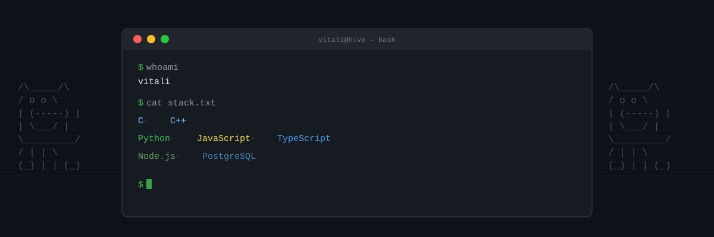

  

<h1 align="center">Hi, I'm Vitali Lund</h1>

  <b>Backend Developer</b> 
  Helsinki, Finland / Barcelona, Spain

  
  &nbsp;
  

---

### About me

My background is unconventional. I've moved countries, changed careers, and rebuilt myself in a completely new field. That means I adapt fast, learn fast, and I'm not afraid of starting from zero.

I'm people-oriented: I connect with others quickly, bring positive energy into a team, and genuinely enjoy collaboration. I have a strong sense of humour, but I also know when to stay focused. People feel comfortable working with me, both professionally and on a human level.

Currently building backend systems with Python and TypeScript, with low-level foundations in C/C++ from [Hive Helsinki (42 Network)](https://www.hive.fi/). Before that: sustainability research, multiple publications, a different life.

---

### Tech stack

  
  
  
  
  

  
  

  
  

---

### Outside of code

Sport / snowboard / food / travel, usually all four at once.

---

  

